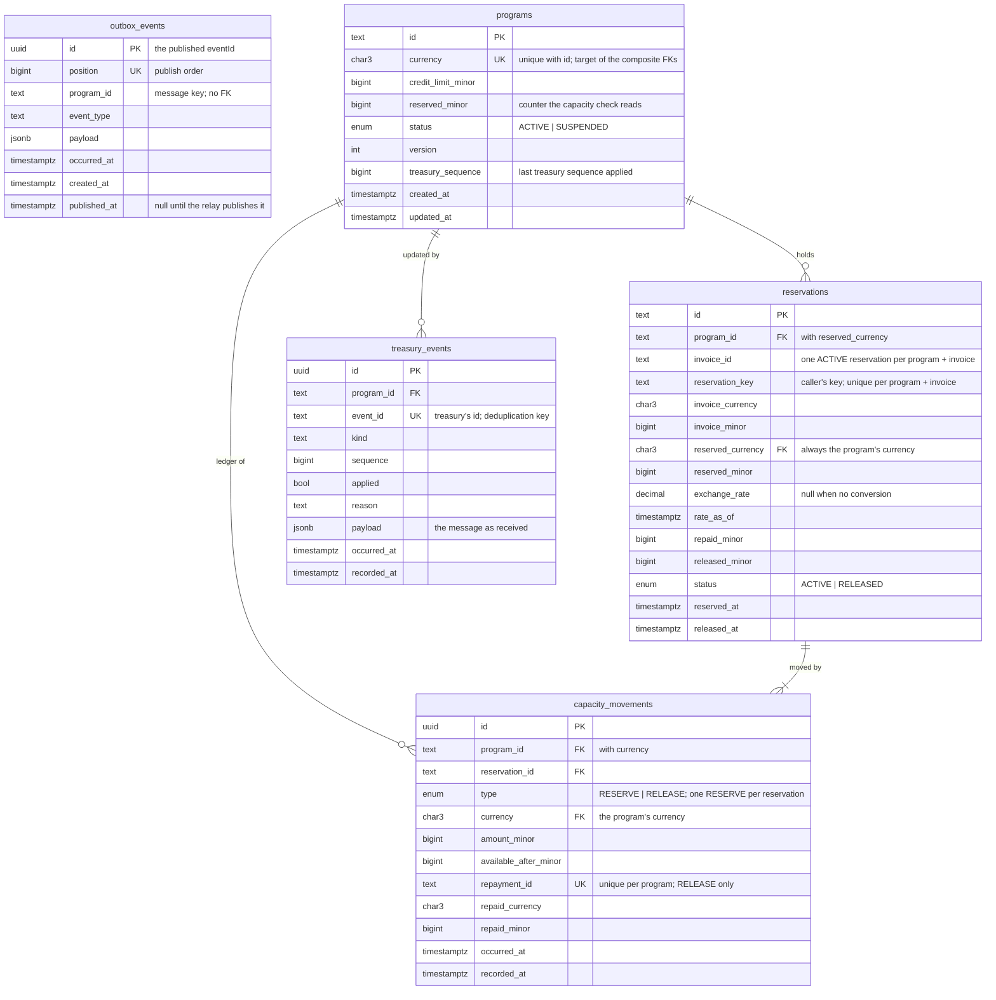

# Architecture

## 1. Purpose

A financing program lends against invoices up to a fixed **credit limit** (for example
$10,000,000). When an invoice is approved for early payment, part of that limit is taken by it;
when the invoice is repaid, that part becomes available again.

This service keeps track of that in real time. For every program it knows the credit limit, how
much is currently reserved by invoices, and how much is still available — and it is the place
where reservations and repayments are recorded, so availability can never be exceeded.

It works alongside two other systems that it does not own:

- **Invoicing** — decides which invoices are approved and when they are repaid, and tells this
  service. The service stores only an invoice's id, amount and currency.
- **Treasury** — where programs are defined, and the system of record for each program's credit
  limit and status. It publishes programs, limit and status changes, and periodic
  reconciliation messages over Kafka.

### 1.1 Assumptions

The brief leaves these open; this is how the service reads them.

- **Programs come from treasury.** The brief does not say where programs are created. Treasury is
  taken to be where they are defined: its first Kafka message for a program id opens the program,
  and there is no HTTP endpoint for creating one.
- **Each system sends only what it owns.** Treasury owns the limit and status, so its messages
  and reconciliations (`program.state.reconciled`) carry only those. This service owns the
  reserved amount; treasury never sends one, since it tracks money paid out, not reservations.
- **"Bulk" reconciliation is one message per program.** A reconciliation run is a burst of
  `program.state.reconciled` messages, one per program, rather than one message listing many
  programs. Each keeps its own sequence, deduplication and dead-lettering, so one bad entry
  cannot hold back or discard the rest.
- **The invoice decides the amount.** A reservation holds the invoice's full amount
  (`invoiceAmount`), in the invoice's currency, sent by the system that approved the invoice.
  The service does not own invoices and cannot verify the amount; it fixes it on the first
  reservation (a different amount for the same invoice is refused) and caps repayments by it.
- **JSON messages without a schema registry.** Messages are JSON, validated with zod on the way
  in (`treasury-message.ts`) and built in one module on the way out (`capacity-events.ts`). With
  more teams sharing these contracts, Avro or Protobuf with a schema registry could be used.
- **Exchange rates come from a static table.** The brief names no rate source, so rates are
  read from configuration (`FX_RATES`) as a stand-in for a live rate service (§4).
- **Partial repayments** are an addition to the brief: invoices can be repaid in instalments,
  each identified by a caller-supplied `repaymentId`.

## 2. Functionality

### 2.1 Programs

- Programs come only from treasury. The first treasury message for a program id opens the
  program, with the id, credit limit and currency the message carries.
- Its current state can be read over HTTP at any time: credit limit, reserved amount, available
  capacity (`creditLimit − reserved`) and status.
- A program is `ACTIVE` or `SUSPENDED`, as treasury says. Only an active program accepts new
  reservations; repayments are accepted in either status. A program starts `ACTIVE` unless its
  first treasury message says otherwise.

### 2.2 Reservations

- Reserving capacity for an invoice creates a **reservation** that holds the invoice's full
  amount against the program's limit. It is refused if that is more than what is available.
- The amount comes from the system that approved the invoice (`invoiceAmount`, in the invoice's
  currency). The service does not own invoices and cannot verify it; it fixes the amount on the
  first reservation and caps repayments by it.
- An invoice has at most one active reservation per program.
- Once an invoice's reservation has been fully repaid, the invoice is reserved again only under
  a new `reservationKey` (§2.6).
- Reservations for a program can be listed, filtered by status and paged with a cursor.

### 2.3 Repayments

- A repayment against an invoice releases capacity back to the program.
- Repayments can be **partial**: an invoice can be repaid in several instalments, each
  releasing its share. A repayment with no amount repays everything still outstanding.
- A repayment may not exceed what is outstanding. When an invoice is fully repaid, its
  reservation becomes `RELEASED` and everything it held is available again.
- Released reservations are kept as history.

### 2.4 Multiple currencies

- A program has one currency; invoices can be in another.
- An invoice in another currency is converted into the program's currency when it is reserved,
  and the exchange rate used is stored with the reservation. Every repayment for that invoice is
  converted with the same stored rate.
- Rounding: reserving rounds up; partial releases round down on the running total; the final
  repayment releases exactly what is left, so total released equals total reserved.

### 2.5 Treasury updates and over limit

- Treasury messages open a program (the first message with a limit for its id) and then change
  its credit limit or its status: a capacity change carries only the limit, a status change only
  the status. A status change for a program that has never been opened is dead-lettered.
- Treasury may lower a limit below what is already reserved. The new limit is applied and the
  program is **over limit**: available capacity is negative, new reservations are refused, and
  repayments bring it back under — each one is accepted, including one that leaves the program
  still over limit (its ledger row records the negative availability). Existing reservations are
  not affected.
- Periodic reconciliation messages carry the program's full state again — limit and status —
  so anything an earlier message missed is brought up to date.
- The reserved amount is this service's alone: reservations are made here, and treasury never
  sees them or sends a figure for them.

### 2.6 Safe retries

Every write can be retried without being applied twice:

| Operation | Repeat with the same data | Repeat with different data |
| --- | --- | --- |
| Reserve without a key (same program + invoice, while active) | returns the existing reservation (`200`) | `INVOICE_ALREADY_RESERVED` |
| Reserve with a `reservationKey` (same program + invoice + key) | returns that reservation (`200`), even once released | `INVOICE_ALREADY_RESERVED` |
| Repay (same `repaymentId`) | returns the original result (`replayed: true`) | `REPAYMENT_ID_REUSED` |
| Treasury message (same `eventId`) | applied once | — |

**Reserving an invoice again after it was repaid.** A reserve request without a key, for an
invoice whose reservation has been fully repaid, is refused with `409 INVOICE_ALREADY_REPAID`.
It may be a retry of the original request that arrived late (a caller's retry queue, a
redelivered message); creating a new reservation would hold capacity for an invoice that is
already settled. To finance the invoice again, the caller sends a new `reservationKey`, which
names that reservation for good: its retries are answered with it, released or not. A new key is
refused while the invoice still holds an active reservation. The key is optional otherwise, so
callers that never re-reserve need not send one.

### 2.7 History

Every change to a program's reserved amount is written to an append-only ledger, and every
treasury message is stored with its outcome and raw payload. Neither is ever updated or deleted.

### 2.8 Events for other services

Every change — a program opened, capacity reserved or released, a limit or status changed — is
published to Kafka (`capacity.events`) for other services, through a transactional outbox: an
event is published if and only if its change committed (§3.11).

## 3. Main parts

### 3.1 Layers and folders

```
presentation (HTTP) ─┐
                     ├──► application ──► domain
infrastructure ──────┘         ▲              ▲
 (Prisma, Kafka, FX) └─────────┴──────────────┴── implements ports declared by these two
```

```
src/
├─ main.ts, app.module.ts   bootstrap and root module
├─ api-docs.ts              OpenAPI document (§3.9)
├─ shared/
│  ├─ domain/        base classes: AggregateRoot, Entity, ValueObject, Identifier,
│  │                 DomainEvent, DomainError, InvariantViolationError
│  ├─ money/         Money, Currency, ExchangeRate, decimal parsing, rounding
│  └─ application/   Clock
├─ contexts/capacity/
│  ├─ domain/          Program, Reservation, ids, events, errors, ports/
│  ├─ application/     one folder per command/query + handler; views; errors; ports/ (read model)
│  ├─ infrastructure/  persistence/prisma, messaging (treasury feed, outbox relay,
│  │                   dead letters, event contract), fx
│  ├─ presentation/    http: controllers, request and response schemas, presenters,
│  │                   error statuses
│  └─ capacity.module.ts
├─ iam/              JWT verification, authentication + authorization guards
├─ platform/         config, Prisma and Kafka clients, HTTP setup (problem details, request
│                    logging and validation), health
└─ generated/prisma  Prisma client (gitignored; generated by `prisma generate` on install)
```

Unit and integration specs sit next to the code in `test/` folders; the top-level `test/` holds
the e2e suite and shared test setup.

- **domain** — business objects and rules. No framework or database imports.
- **application** — command and query handlers (`@nestjs/cqrs`), and the views they return.
- **infrastructure** — Prisma repositories and read model, the Kafka consumer, the outbox relay,
  the FX rate provider.
- **presentation** — HTTP controllers, request and response schemas, presenters.

Ports are TypeScript interfaces in `domain/ports` (and, for the read model,
`application/ports`), each with a `Symbol` injection token, bound to their implementations in
`capacity.module.ts`.

### 3.2 Domain model

**`Program`** — `creditLimit`, `reservedAmount` (running total of active holds), `status`,
`treasurySequence`, `version`. Methods: `openFromTreasury`, `reserveFor`, `release`,
`applyTreasuryState`.

**`Reservation`** — one hold for one invoice: invoice amount (invoice currency), reserved amount
(program currency), rate snapshot, repaid and released amounts, status (`ACTIVE → RELEASED`),
timestamps. Method: `recordRepayment`.

`Program` and `Reservation` refer to each other by id. `program.reserveFor(...)` creates each
reservation, and `program.release(reservation, …)` applies each repayment, updating the
reservation and the program's counter together; both are saved in one transaction.
`reservedAmount` always equals the sum held by active reservations and the sum of ledger
movements (§3.5).

**`Money`** — an integer amount in minor units (`bigint`) with a currency; arithmetic across
currencies is rejected. Ids (`ProgramId`, `ReservationId`, `InvoiceId`, `RepaymentId`) are
separate value classes.

**Domain events** — `ProgramOpened`, `CapacityReserved`, `CapacityReleased`,
`CreditLimitChanged`, `ProgramStatusChanged`. Aggregates record them with `raise()`.

### 3.3 Use cases

| Message | Kind | Entry point |
| --- | --- | --- |
| `ApplyTreasuryUpdateCommand` | command | Kafka (§3.8) — opens or updates a program |
| `ReserveCapacityCommand` | command | HTTP |
| `RecordRepaymentCommand` | command | HTTP |
| `GetProgramCapacityQuery` | query | HTTP |
| `ListReservationsQuery` | query | HTTP |

Command handlers: lock the program (`lockById`) → call the domain → save → write the ledger and
the outbox → commit. The outbox relay then publishes the events to Kafka (§3.11). When the
treasury handler finds no program to lock, it opens one with `Program.openFromTreasury` and
inserts it.

For a reservation in another currency, the FX rate is fetched before the transaction opens.

Handlers return **views** (plain data), not aggregates. Queries go through `CapacityReadModel`,
which reads without locks. The current time comes from an injected `Clock`.

### 3.4 Concurrency

Each command locks its program row with `SELECT … FOR UPDATE` for the whole transaction. Writers
to the same program run one at a time; writers to different programs run in parallel. No
network calls happen inside the transaction, and each transaction locks exactly one program row
before touching reservations.

| Setting | Effect |
| --- | --- |
| `lock_timeout` (3 s) | a waiter gives up with `503 CAPACITY_BUSY` |
| `statement_timeout` (5 s) | caps any single statement |
| `idle_in_transaction_session_timeout` / transaction timeout (10 s) | frees a lock held by a stalled transaction |

`version` is incremented on every save and checked on write.

### 3.5 Capacity ledger

Every change to `reservedAmount` writes one row to `capacity_movements` (`RESERVE` or `RELEASE`)
in the same transaction, from the `CapacityReserved` / `CapacityReleased` events. The ledger
holds the unique `repayment_id` used to detect repeated repayments. Current state is read from
`programs.reserved_minor`, not rebuilt from the ledger.

### 3.6 Persistence

PostgreSQL through Prisma. Domain objects and Prisma rows are converted by explicit mappers in
`infrastructure/persistence/prisma/mappers.ts`.

| Table | Contents |
| --- | --- |
| `programs` | limit, reserved counter, status, version, treasury sequence |
| `reservations` | invoice and reserved amounts, rate snapshot, repaid/released, status |
| `capacity_movements` | the ledger, append-only |
| `treasury_events` | every accepted treasury message with outcome and raw payload, append-only |
| `outbox_events` | events waiting to be published, in `position` order; marked published by the relay |



`capacity_movements` and `treasury_events` are append-only (triggers reject `UPDATE` and
`DELETE`). `outbox_events` stands alone: it has no foreign keys, being a queue of messages
rather than part of the model (§3.11).

Amounts are stored as `BIGINT` minor units beside a currency code. The database also enforces
the main rules (Prisma schema plus hand-written SQL in the migrations):

- `CHECK`s — positive limit, `reserved ≥ 0`, `0 ≤ repaid ≤ invoice`, `0 ≤ released ≤ reserved`,
  a ledger movement never negative (its `available_after` may be, while over limit),
  `RELEASED` ⇔ fully repaid ⇔ `released_at` set, rate and its timestamp set together
- unique indexes — one active reservation per invoice, one `RESERVE` per reservation, one
  reservation per invoice and `reservation_key`
- composite foreign keys on `(program_id, currency)` — a reservation's held amount and every
  ledger row are in their program's currency (the invoice itself may be in any currency), and a
  program's currency cannot be changed once anything refers to it (`ON UPDATE RESTRICT`)
- triggers rejecting `UPDATE`/`DELETE` on `capacity_movements` and `treasury_events`

### 3.7 HTTP API

| Endpoint | Scope | Success |
| --- | --- | --- |
| `GET /programs/:programId/capacity` | `capacity:read` | 200 |
| `POST /programs/:programId/reservations` | `reservations:write` | 201 reserved · 200 identical repeat |
| `GET /programs/:programId/reservations?status=&limit=&cursor=` | `capacity:read` | 200, cursor-paged |
| `POST /programs/:programId/reservations/:invoiceId/repayments` | `repayments:write` | 201 applied · 200 replayed |
| `GET /health/live`, `GET /health/ready` | none | 200 · 503 when the database is down |

**Authentication and authorization.** Bearer JWTs (HS256) with the algorithm pinned and issuer,
audience and expiry checked. Two global guards: authentication on every route except those
marked `@Public()` (the health probes); authorization requiring every route to declare
`@RequireScopes(...)` and checking any `:programId` against the token's `programs` claim (`"*"`
or a list of ids).

| Claim | Required | Used for |
| --- | --- | --- |
| `sub` | yes | the caller; written to the request log |
| `iss`, `aud` | yes | must match `JWT_ISSUER` and `JWT_AUDIENCE` |
| `exp` | yes | expiry, with `JWT_CLOCK_TOLERANCE_SECONDS` of leeway |
| `scope` | no | space-separated scopes; none when absent |
| `programs` | no | `"*"` or a list of program ids; none when absent |

One scope per operation, because different systems perform them: `capacity:read` for clients
reading availability, `reservations:write` for the system that approves invoices, and
`repayments:write` for the one that learns of repayments.

**Input.** Parsed with zod directly into domain values. Amounts are decimal strings, unknown
fields are rejected, ids are URL-safe (1–128 of letters, digits, `.`, `_`, `:`, `-`; the treasury
feed enforces the same rule on program ids), bodies are limited to 16 KB.

**Errors.** RFC 9457 `application/problem+json` with a `code`, a `detail`, and extra fields where
relevant (e.g. `requested` / `available`).

| Status | Codes |
| --- | --- |
| 400 | `VALIDATION_FAILED`, `MALFORMED_JSON`, `INVALID_QUERY` |
| 401 / 403 | `UNAUTHENTICATED` / `FORBIDDEN` |
| 404 | `PROGRAM_NOT_FOUND`, `RESERVATION_NOT_FOUND`, `NOT_FOUND` |
| 409 | `INSUFFICIENT_CAPACITY`, `PROGRAM_NOT_ACTIVE`, `INVOICE_ALREADY_RESERVED`, `INVOICE_ALREADY_REPAID`, `RESERVATION_ALREADY_RELEASED`, `REPAYMENT_ID_REUSED` |
| 413 | `PAYLOAD_TOO_LARGE` |
| 422 | `INVALID_AMOUNT`, `REPAYMENT_EXCEEDS_OUTSTANDING`, `REPAYMENT_CURRENCY_MISMATCH`, `CURRENCY_NOT_CONVERTIBLE`, `UNSUPPORTED_CURRENCY` |
| 500 | `INTERNAL_ERROR` (includes invariant violations and unmapped codes) |
| 503 | `CAPACITY_BUSY`, with `Retry-After` |

Domain error codes are mapped to statuses in `presentation/http/error-statuses.ts`.

### 3.8 Treasury feed

Consumed in `contexts/capacity/infrastructure/messaging/`. It is the only way programs are
opened and their limits and status changed. Each type carries exactly what it is about, and
nothing else is accepted:

| Event type | Meaning | Carries |
| --- | --- | --- |
| `program.capacity.changed` | the limit changed | `creditLimit` only |
| `program.status.changed` | the status changed | `status` only |
| `program.state.reconciled` | periodic bulk reconciliation: the full state again | `creditLimit` and `status` |

```json
{
  "eventId": "treasury-8f1c",
  "eventType": "program.status.changed",
  "occurredAt": "2026-09-21T10:00:00Z",
  "sequence": 42,
  "program": { "id": "program-1", "status": "SUSPENDED" }
}
```

- `status` is `ACTIVE` or `SUSPENDED`.
- The program id follows the HTTP API's id rule (§3.7), so every program treasury opens can be
  addressed over HTTP; any other id is dead-lettered.
- A program is opened by the first capacity change or reconciliation for its id. A status change
  cannot open one (there is no limit to open it with) and is dead-lettered as `PROGRAM_NOT_FOUND`.
- A reconciliation is the full state, so after it the program matches treasury in everything
  treasury owns — including anything an earlier message missed.
- `sequence` is per program across all three types.

Flow: `treasury-feed` (subscription) → `treasury-message-processor` (error handling) →
`treasury-message` (parsing) → `ApplyTreasuryUpdateHandler` → `Program.applyTreasuryState`.

- **Parsing** — `treasury-message.ts` is the only file that knows treasury's message format. It
  validates with zod (unknown fields rejected), converts amounts to `Money` and builds an
  `ApplyTreasuryUpdateCommand`.
- **Ordering** — each message has a per-program `sequence`; a message not newer than the last
  applied one is recorded and ignored.
- **Opening** — a message for an unknown program id opens the program. If two first messages
  for the same id race, the database's unique key lets one insert win; the other is retried
  once and applied as an update.
- **Duplicates** — `eventId` is unique in `treasury_events`, written in the same transaction as
  the update.

| Failure | Examples | Action |
| --- | --- | --- |
| Permanent | invalid JSON, wrong schema, a credit limit that is not positive, an amount in another currency than the program's | published to the dead-letter topic with the original bytes; consumption continues |
| Temporary | program locked, database unavailable, dead-letter topic unreachable | error rethrown after a backoff (200 ms doubling to 10 s); offset not committed; message redelivered |

Unrecognised errors are treated as temporary. The client redelivers a failed message
immediately, so the backoff is what keeps an outage from becoming a tight retry loop; waiting
holds the partition, which per-program order needs anyway. After ten consecutive failures each
further one is logged as an error: the partition is stuck and someone should look.

The consumer runs only when `KAFKA_ENABLED=true` (the default in `.env.example` and in the
Docker stack). Brokers, topics, group id, TLS and SASL come from `KAFKA_*` environment variables.

**Topics and client settings.** Production-shaped locally, so a difference shows up on a laptop
rather than in a deploy:

- **Provisioned, never auto-created.** The service does not create topics, and the local broker
  has auto-creation off, as production brokers do. `docker/redpanda/create-topics.sh` creates
  them (the `kafka-topics` Compose service, also run by `npm run infra:up`); in a real environment
  the same settings live in infrastructure as code. At startup the service checks that its
  topics exist and refuses to start if one does not, rather than waiting on a feed that will
  never arrive.

  | Topic | Partitions | Retention | Key |
  | --- | --- | --- | --- |
  | `treasury.program-capacity` (treasury's) | 3 | 7 days | program id |
  | `treasury.program-capacity.dead-letter` | 1 | 30 days | original key |
  | `capacity.events` | 6 | 7 days | program id |

  Replication factor 1 locally (one broker); 3 with `min.insync.replicas=2` in production.
  Partition counts are hard to raise later: adding partitions moves keys, and with them
  per-program order.
- **Producers are idempotent** (`acks=all`), so a retried batch is neither duplicated nor
  reordered behind the one after it, and a send fails after 15 s rather than librdkafka's default
  five minutes (`platform/kafka/kafka-client.ts`).
- **TLS and SASL** (`KAFKA_SSL`, `KAFKA_SSL_CA_LOCATION`, `KAFKA_SASL_MECHANISM`,
  `KAFKA_SASL_USERNAME`, `KAFKA_SASL_PASSWORD`). Off locally; in production the configuration is
  rejected without both.

Local tools that play the treasury system:

- `npm run treasury` — publishes one message (`scripts/publish-treasury-message.ts`).
- `treasury-seed` — a Docker Compose service that publishes two demo programs at startup
  (`program-1`, 10,000,000 USD; `program-2`, 5,000,000 EUR).
- Redpanda's HTTP proxy (port 18082) — lets HTTP clients such as the Postman collection publish.
- Redpanda Console (port 8080) — a web UI to browse topics, read dead letters and publish.

### 3.9 Configuration and operations

- **Config** — environment variables, validated at startup. In production the example JWT
  secret and the development FX table are rejected.
- **FX rates** — a static rate table (`FX_RATES`), a stand-in for a live rate service (§4);
  built-in illustrative rates outside production, where `FX_RATES` is required.
- **Health** — `/health/live` does not query the database; `/health/ready` does. Kafka is
  deliberately not part of readiness: without the broker the API still reserves and releases
  correctly (limits are briefly stale, events wait in the outbox), and failing readiness would
  take every instance out of the load balancer for an outage that does not stop them working.
  Kafka problems surface instead as a refused start (missing topics), error logs (a stuck
  partition, a failing relay) and, in production, consumer-lag alerts.
- **Logging** — one line per request, written by middleware.
- **API documentation** — OpenAPI 3.0 at `/docs` (Swagger UI) and `/docs/openapi.json`, no token
  needed. Request schemas are generated from the zod schemas that validate requests; response
  schemas live in `presentation/http/response-schemas.ts`, and an end-to-end test checks real
  responses against them. The document is built in `src/api-docs.ts`.

What is left for production — tokens from an identity provider (JWKS), the caller stored with
each change, Kafka ACLs and metrics — is listed in §4.

### 3.10 Testing

| Layer | How |
| --- | --- |
| Domain | Vitest unit tests: rules, rounding, repayment sequences |
| Application | handlers against in-memory fakes of the ports |
| Integration | real Postgres and Kafka: repositories, constraints, locking, lock timeout, Kafka feed |
| E2E | the whole app with a real Kafka topic: programs published by a stand-in treasury, then reservations, repayments, limit and status changes, auth and error statuses over HTTP (Supertest) |
| API | the Postman collection, run with Newman (`npm run test:api`); it publishes its own program through the HTTP proxy |

Integration and end-to-end runs start their own Postgres and Kafka (Redpanda) containers with
Testcontainers (`test/infrastructure/global-setup.ts`) and remove them afterwards; each suite also
creates its own Kafka topics.

The outbox relay has its own integration test: a reservation and a repayment over HTTP arrive on
the events topic in order, keyed by program, and are marked published.

A concurrency test sends many parallel reservations to a nearly full program and checks that the
limit is never exceeded and every reservation that fits succeeds.

### 3.11 Published events (transactional outbox)

What this service announces, on `KAFKA_CAPACITY_EVENTS_TOPIC` (default `capacity.events`):

| `eventType` | When |
| --- | --- |
| `capacity.program-opened` | treasury's first message for a program opened it (with its `creditLimit` and `status`, which may be `SUSPENDED`) |
| `capacity.reserved` | capacity was reserved for an invoice |
| `capacity.released` | a repayment released capacity |
| `capacity.credit-limit-changed` | treasury changed the limit (with `overLimit`) |
| `capacity.program-status-changed` | treasury suspended or reactivated the program |

```json
{
  "eventId": "b309d7c4-…",
  "eventType": "capacity.reserved",
  "occurredAt": "2026-09-22T16:13:27.123Z",
  "programId": "program-1",
  "data": {
    "reservationId": "…",
    "invoiceId": "invoice-1",
    "invoiceAmount": { "amount": "100000.00", "currency": "EUR" },
    "reservedAmount": { "amount": "109000.00", "currency": "USD" },
    "availableAfter": { "amount": "9891000.00", "currency": "USD" }
  }
}
```

- **Written with the change.** Command handlers add their domain events to `outbox_events` in the
  same transaction as the change, so an event exists if and only if its change committed. The
  message is built then (`infrastructure/messaging/capacity-events.ts`, the public contract), so
  an event with no contract fails the change rather than the relay.
- **Published by the relay** (`OutboxRelay`, every `OUTBOX_POLL_INTERVAL_MS`, default 500 ms): it
  takes the oldest unpublished events in `position` order, publishes them keyed by program id, and
  marks them published — in one transaction, so an event is marked only after the broker
  acknowledged it.
- **Order.** A Postgres advisory lock lets one instance relay at a time, so events leave in the
  order they were written, and the idempotent producer keeps each program's events in order on
  their partition through retries. The lock is the relay's own and touches no program row, so the
  Kafka call inside that transaction holds up no reservation.
- **Why the send is inside the relay's transaction.** The business transaction never talks to
  Kafka — it only writes the outbox row. The relay's transaction is a different, short one that
  exists to hold the advisory lock and mark the batch; `send` sits inside it so that "marked"
  can only follow "acknowledged". The cost is one pooled connection held for the length of a
  send, bounded by the producer's 15 s delivery timeout; the transaction's own timeout is twice
  that, so a broker outage fails the send and rolls back cleanly. Change data capture (Debezium
  reading the outbox table from the WAL) removes the polling and the held connection, at the
  price of running Kafka Connect; it is the step up if volume ever calls for it.
- **At least once.** If publishing fails, nothing is marked and the batch is sent again; a
  consumer drops a message whose `eventId` it has already seen (also in the `event-id` header).
- **Off without Kafka.** With `KAFKA_ENABLED=false` events accumulate in the outbox and are
  published once the relay runs.
- **Not yet:** a clean-up of published rows (they are kept, and could be pruned after a retention
  period).

## 4. Before production

Deliberately left out of this version, and needed before it handles real money:

- **A live exchange-rate source.** Rates change continuously; a static table goes stale within
  hours. Production needs a provider that calls a rate service, bound in `capacity.module.ts` in
  place of `StaticExchangeRateProvider`, behind the existing `ExchangeRateProvider` port. It
  should cache rates with a short refresh interval, refuse to convert when the newest rate is
  older than a maximum age (`CURRENCY_NOT_CONVERTIBLE` rather than a reservation at an outdated
  rate), and time out cleanly when the service is down. Nothing else changes: rates are already
  fetched before the transaction opens, and each reservation stores the rate and its `asOf`.

- **Tokens signed by an identity provider.** Tokens are HS256 with a shared secret, which keeps
  local runs self-contained but means anything that can verify a token can also mint one.
  Production should verify asymmetric tokens (RS256/ES256) against the identity provider's JWKS
  endpoint. The change is confined to `src/iam/token-verifier.ts` and its configuration.
- **Who made each change, stored with the data.** The caller (`sub`) is written to the request
  log, but not to the ledger or the reservations, so the data says *what* changed and not *who*
  changed it. Storing the caller on each ledger row (and on the reservation) would make the
  audit trail complete without relying on log retention.
- **Kafka ACLs and topic provisioning.** The service connects over TLS with SASL in production
  (`KAFKA_SSL`, `KAFKA_SASL_*`; required when `NODE_ENV=production`), but the broker side is the
  platform's: ACLs so that only treasury can publish to `treasury.program-capacity` — anything
  that can publish there can open programs and change limits — and the topics themselves,
  created by infrastructure as code with the settings in `docker/redpanda/create-topics.sh` and a
  replication factor of 3 (`min.insync.replicas=2`).
- **A production image.** The Docker image runs with `NODE_ENV=development` and keeps dev
  dependencies, so the Compose stack can mint tokens and play treasury from it. Production needs
  its own stage: `npm ci --omit=dev`, `NODE_ENV=production`, migrations run as a separate job.
- **Metrics and alerting.** Consumer-group lag on the treasury feed, the outbox backlog and the
  dead-letter topic's growth are what to alert on; today they show only in the logs (a partition
  stuck behind a failing message is logged as an error after ten attempts).
